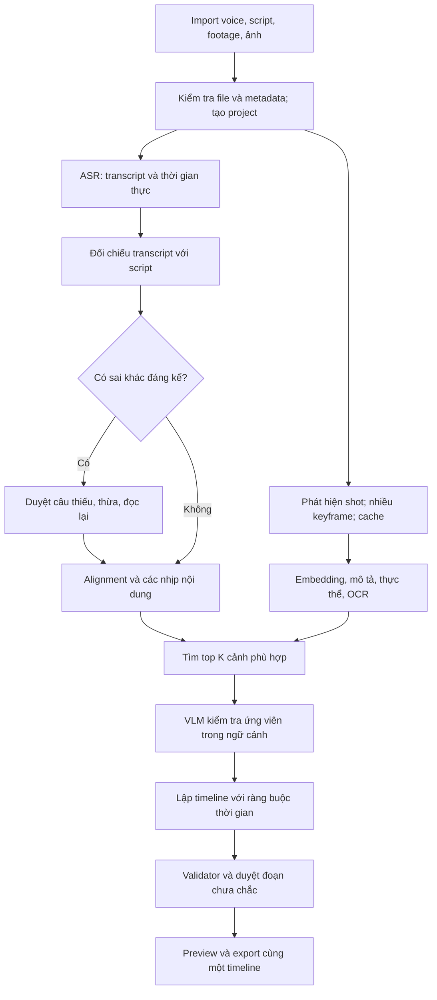

**SyncCut — đánh giá kỹ thuật và đề xuất tái thiết pipeline**

Cập nhật yêu cầu: máy khách hàng có **32 GB RAM, RTX 3060 12 GB VRAM**, source chủ yếu **tiếng Anh**. Khuyến nghị model/phần cứng trong tài liệu này đã được thay thế bởi [đề xuất backend và model cho máy khách](</C:/Users/Tran Bao Long/Desktop/VuLoc/audit/SyncCut-backend-model-proposal-RTX3060-English.md>). Các kết quả kiểm tra bên dưới là lịch sử audit trên máy phát triển, không phải benchmark máy khách.

Ngày kiểm tra: 14/09/2026. Mã nguồn tại commit `2fabdc4c416bf188a5614dae3d589d811f2772b6`, phiên bản khai báo 0.1.4. Thư mục dự án: `C:/Users/Tran Bao Long/Desktop/VuLoc`.

**Kết luận**

App hiện chưa đáp ứng phần cốt lõi của yêu cầu: xác minh voice khớp kịch bản, hiểu ngữ cảnh và chọn đúng đoạn hình để dựng theo lời đọc. Vấn đề gồm cả thuật toán chưa được triển khai thực chất, kết quả fallback bị trình bày như kết quả AI, trạng thái UI sai và đóng gói runtime thiếu. Thay một model mạnh hơn sẽ không tự sửa được các lớp này.

Nên giữ Tauri/React, các phần import và media utilities có thể tái sử dụng, nhưng viết lại lõi alignment–retrieval–timeline cùng hợp đồng dữ liệu giữa UI và backend. Đầu ra nên là bản dựng nháp có bằng chứng, cho phép duyệt nhanh những chỗ chưa chắc. Mục tiêu giảm thời gian editor chỉnh sửa cần được đo trên dữ liệu khách hàng; chưa có cơ sở để cam kết tự động đúng tuyệt đối.

**Phạm vi và bằng chứng đã chạy**

- Đọc luồng chính từ React → Tauri commands → Python → JSON → preview/XML, cùng cấu hình đóng gói, persistence, setup/settings và các phần phụ trợ liên quan.
- `npm run build`: thành công.
- `cargo check --offline` trong `src-tauri`: thành công.
- `python audit/reproduce_findings.py`: 9/9 tình huống tái hiện lỗi. Đây là kiểm tra xác nhận lỗi, không phải 9 kiểm thử chứng minh app chạy đúng. Các dependency ASR/VLM được mock rõ ràng ở những phép kiểm tra logic; không tải model.
- Chạy CLI matcher thực với `demo_assets/sample_voice.mp3`, `sample_script.txt`, `sample_broll.mp4`: exit code 0, 5 câu, voice khoảng 15.046531 giây, footage 15 giây. Python báo thiếu `torch` ở cả speech và visual, nhưng đầu ra vẫn có điểm 89–93%. Xem `audit/demo_current_environment.json`.
- Interpreter đang được shell phân giải: `C:/msys64/mingw64/bin/python.exe`. Không tìm thấy `torch`, `faster_whisper`, `whisper`, `open_clip`, `insightface`, `transformers` trong interpreter này. Điều này không có nghĩa mọi Python environment trên máy đều thiếu; app hiện gọi tên `python` nên phụ thuộc PATH của tiến trình khởi chạy.
- Máy kiểm tra có RAM khoảng 15.8 GiB và GTX 1650 Max-Q, VRAM khoảng 4 GB. Đây chưa chắc là cấu hình máy khách hàng.
- Chưa kiểm thử thao tác trên cửa sổ desktop, cài installer trên máy sạch, chạy inference model thật, hay import XML vào Premiere/Resolve. Phát hiện về UI/XML dưới đây được xác định từ code; chất lượng ngữ nghĩa và tốc độ trên dữ liệu khách hàng chưa được đo.
- Không thay đổi mã nguồn sản phẩm trong lần đánh giá này; các tệp mới nằm trong `audit/`.

**Các lỗi cần xử lý, theo mức độ ảnh hưởng**

P1: ảnh hưởng trực tiếp tính đúng hoặc khả năng sử dụng chức năng chính. P2: ảnh hưởng độ tin cậy, hiệu năng, triển khai và khả năng bảo trì.

| ID | Mức | Phát hiện và tác động | Vị trí mã nguồn |
|---|---|---|---|
| F01 | P1 | Deep không nạp Qwen và không đọc ảnh. Chỉ `import torch`, gán điểm 75, cộng điểm nếu có mặt và gặp từ khóa tiếng Anh. Người dùng chọn Deep nhưng không nhận được phân tích sâu. | `engine/voice_visual_matcher.py:255` |
| F02 | P1 | Khi visual model lỗi, điểm được tạo từ `hash(text + shot_index)`; khi Python không chạy, Rust chọn footage theo vòng và gán 92%. Cosine 0 cũng được biến thành 78; scheduler ép điểm tối thiểu 75. Các phần trăm không phải độ tin cậy đã hiệu chỉnh. | `engine/voice_visual_matcher.py:315`, `:332`, `:406`; `src-tauri/src/lib.rs:281`, `:359`, `:388` |
| F03 | P1 | Alignment lấy số từ của câu kịch bản để tiêu thụ từng ấy từ ASR, không đối chiếu nội dung từ. Đọc thiếu, thừa, lặp, sai câu hoặc đổi thứ tự có thể làm lệch các câu tiếp theo. Thay toàn bộ từ kịch bản bằng nội dung khác cùng số từ vẫn nhận cùng timestamp trong probe. | `engine/voice_visual_matcher.py:105`; `engine/aligner.py:110`; bản aligner trùng trong `src-tauri/engine/` |
| F04 | P1 | Thiếu model được chuyển sang chia thời gian theo số từ rồi báo thành công. Không có báo cáo voice/script mismatch, không phân biệt alignment thật và ước lượng. `aligner.py` còn gọi fallback là “energy-based” dù không phân tích năng lượng. | `engine/voice_visual_matcher.py:139`; `engine/aligner.py:306`; `src-tauri/src/lib.rs:264` |
| F05 | P1 | Scheduler không bảo đảm biên nguồn: voice 12s + footage 5s cho `sourceOut=12`. Đoạn 8s có thể kéo vượt shot 4.5s dù file còn dài, đi sang nội dung chưa được chấm điểm. Khoảng im lặng trong alignment cũng không được lấp như lời hứa “100% coverage”. | `engine/voice_visual_matcher.py:343`; `src-tauri/src/lib.rs:361` |
| F06 | P1 | Phần settings chỉ lưu localStorage. Whisper model, visual model, VAD, language, pacing, confidence threshold, format và FPS không đi vào matcher command. Export chính cố định 30 FPS. Cấu hình provider/API cũng không nối với pipeline. | `src/components/workspace/AIMatcherTab.tsx:52`; `src/components/AIPipelineDock.tsx:358`; `src/App.tsx:603`; `src/components/modals/SettingsModal.tsx:76` |
| F07 | P1 | Chọn footage đưa app vào source preview. Sau khi matching xong chỉ set segments, không chuyển sang sequence preview. Do `previewAsset` có ưu tiên, app có thể tiếp tục phát file gốc. Đóng preview/Escape lại gọi hàm xóa cả kết quả và cache segments. | `src/App.tsx:247`, `:434`, `:902`, `:955`; `src/components/ProgramMonitor.tsx:124`, `:221` |
| F08 | P1 | Khi chuyển file nguồn, thẻ video bị remount theo `key=activeVideoPath` nhưng effect gọi play chỉ phụ thuộc `isPlaying`. Video mới có thể đứng trong khi voice chạy. Hình timeline không có nhánh `` theo assetType; khoảng trống chọn nhầm segment cuối; âm thanh B-roll không bị mute bắt buộc trong sequence. | `src/components/ProgramMonitor.tsx:143`, `:170`, `:213`, `:505`, `:523` |
| F09 | P1 | Dedupe theo tên làm mất clip khác thư mục nhưng trùng tên, phổ biến với tên camera như `C0001.mp4`. Scan dùng tên để thay path nên có thể trỏ asset sang file khác. ID `name_size` cũng có thể trùng. Frontend scan đọc `file_type/size_bytes` trong khi Rust serialize camelCase, làm sai loại và kích thước file. | `src/App.tsx:29`, `:263`; `src-tauri/src/lib.rs:35`, `:171`, `:1925` |
| F10 | P1 | Bundle chỉ khai báo yt-dlp; không đóng gói matcher, Python runtime, ffmpeg/ffprobe hoặc manifest model. Engine được tìm tương đối theo current working directory. Máy phát triển có thư mục source/bin không chứng minh installer chạy được trên máy khách. | `src-tauri/tauri.conf.json:43`; `src-tauri/src/lib.rs:239`, `:249`; `.github/workflows/release.yml` |
| F11 | P1 | XML dùng FPS sequence cho cả source, khai báo tất cả video 1920×1080, source duration bịa thêm 18000 frame và audio luôn 48kHz/stereo. Không kiểm tra source range trước export. Với mixed FPS/resolution, metadata không phản ánh media thật; cần xác minh trong NLE trước khi coi là production-ready. | `src-tauri/src/lib.rs:652`, `:691`, `:699`, `:725`, `:838` |
| F12 | P1 | Đổi voice/script không đánh dấu timeline cũ hết hiệu lực. Có thể xuất segments của voice trước với audio mới. Selected footage list không được lưu, xóa asset cũng không luôn loại khỏi mảng nhiều footage. Trạng thái toàn cục localStorage chưa đại diện một project có phiên bản. | `src/App.tsx:144`, `:162`, `:182`, `:593`, `:933` |
| F13 | P2 | “Phát hiện shot” là cắt đều 4.5s, một frame ở giữa; `floor` làm bỏ đoạn cuối (video 10s chỉ index đến 9s). Không nhận diện cut, hành động, OCR, chất lượng, ngữ cảnh trước/sau. Có thể bỏ lỡ khoảnh khắc quan trọng. | `engine/voice_visual_matcher.py:166` |
| F14 | P2 | Face ID thực tế chỉ bật module detection và ghi có/không có mặt. Không có face embedding/reference catalog để xác định người nào. Từ khóa tiếng Anh không giải quyết tên nhân vật hoặc thực thể chuyên ngành trong kịch bản Việt. | `engine/voice_visual_matcher.py:221` |
| F15 | P2 | Gom tất cả ảnh vào một tensor, chạy model lại mỗi job, trích mỗi thumbnail bằng một tiến trình ffmpeg riêng. Không có persistent index/cache, batch budget, checkpoint, cancel, timeout hoặc progress từ Python. Rust `Command.output()` giữ stderr rồi bỏ qua ở matcher. | `engine/voice_visual_matcher.py:193`, `:293`; `src-tauri/src/lib.rs:249` |
| F16 | P2 | Hai pipeline khác nhau: luồng UI hiện gọi `execute_voice_visual_matching`; `execute_pipeline` cũ vẫn đăng ký command và có fallback script demo, chọn nguồn theo chỉ số, “image” nhưng đường dẫn video. `render_preview_video` cũ nối clip liên tiếp, bỏ khoảng trống timeline, bỏ lỗi subclip, cố định 30 FPS, thiếu mapping stream rõ ràng và xử lý still image. Hai command cũ không được UI hiện gọi. | `src-tauri/src/lib.rs:880`, `:944`, `:1028`, `:1065`; `src/App.tsx`; `src/components/AIPipelineDock.tsx` |
| F17 | P2 | Import cho chọn SRT nhưng parser coi số thứ tự/timecode như văn bản; scan bỏ mọi TXT nên script trong folder không được phát hiện. UI chọn ảnh không nhất quán với slot picker chỉ lấy video. Python matcher luôn xuất `assetType=video`, kể cả nguồn ảnh nếu lọt vào. | `src-tauri/src/lib.rs:144`, `:1914`; `engine/voice_visual_matcher.py:58`, `:414`; `src/components/AIPipelineDock.tsx:314` |
| F18 | P2 | Updater nhận URL từ UI, kiểm tra exit code và kích thước rồi thực thi installer, chưa xác minh chữ ký. API key lưu trong localStorage trong khi CSP bị tắt. Đây là thiếu sót trước khi triển khai thật; chưa có thử nghiệm khai thác và không kết luận máy đang bị xâm nhập. | `src-tauri/src/lib.rs:1969`, `:2049`, `:2075`; `src/components/modals/SettingsModal.tsx:78`; `src-tauri/tauri.conf.json:40` |

**Kiến trúc đề xuất: pipeline có kiểm chứng, dùng model cho những bước cần hiểu nội dung**



**1. Voice và kịch bản: lấy bản ghi âm làm trục thời gian**

Giữ riêng `script_original`, `transcript_observed`, `script_normalized` và các liên kết giữa chúng. Chuẩn hóa chữ số, dấu câu, viết tắt, Unicode và từ ngoại ngữ theo ngôn ngữ; không sửa mất nguyên bản. ASR nhận dạng lời thực sự được đọc trước khi đối chiếu với kịch bản, để còn phát hiện sai lệch.

Đối chiếu bằng sequence alignment có anchor, đánh dấu đoạn thiếu/thừa/sai/lặp. Với lần đọc lại, tạo các take và đề xuất take dùng thay vì kéo cả chuỗi timestamp theo số từ. Cho người dùng xác nhận đoạn khác biệt quan trọng. Forced alignment áp dụng trên văn bản đã đối chiếu và vùng audio phù hợp; không ép câu chưa từng được đọc vào audio rồi gọi là khớp.

WhisperX là ứng viên thử nghiệm cho alignment; mô hình acoustic alignment phụ thuộc ngôn ngữ. Phải kiểm chứng model và dữ liệu tiếng Việt cụ thể, bao gồm tên riêng, số, giọng vùng miền, không suy ra chất lượng chỉ từ việc Whisper nhận dạng được tiếng Việt. Nguồn: [WhisperX alignment implementation](https://github.com/m-bain/whisperX/blob/main/whisperx/alignment.py).

Sau đó gom thành các nhịp nội dung: một câu dài có thể cần vài shot; vài câu ngắn liên tục có thể dùng một shot. Khoảng im lặng và nhịp thở có chủ đích cần chính sách riêng, không kéo câu cuối phủ hết voice.

**2. Footage: lập thư viện cảnh có bằng chứng**

Tạo shot theo chuyển cảnh; các shot dài cần thêm cửa sổ thời gian để tìm hành động bên trong. Lấy nhiều keyframe và timestamp; dùng clip ngắn khi động tác hoặc thứ tự sự kiện quan trọng. Chấm chất lượng hình, black frame, blur, độ rung, OCR khi cần, loại shot không dùng được. Ảnh tĩnh có loại dữ liệu riêng, không dùng duration video giả.

PySceneDetect cung cấp ContentDetector và AdaptiveDetector để tìm chuyển cảnh; detector không tự hiểu ý nghĩa cảnh. Đây là bước phân đoạn trước retrieval. Nguồn: [tài liệu detector](https://www.scenedetect.com/docs/api/detectors.html).

Mỗi shot có `media_id`, source range, keyframes, mô tả quan sát được, đối tượng/hành động/bối cảnh, quality flags, model version. Với tên nhân vật, sản phẩm hay thế giới giả tưởng, cho phép bộ ảnh và tên tham chiếu do khách hàng cung cấp. Phát hiện có mặt người không đủ để xác nhận một nhân vật.

**3. Hiểu ngữ cảnh và tìm cảnh theo hai bước**

Dùng model ngôn ngữ để tạo bản tóm tắt toàn kịch bản và yêu cầu hình cho từng nhịp: ai/cái gì, hành động gì, ở đâu, yếu tố bắt buộc, hình minh họa chấp nhận được, điều không nên xuất hiện. Giải quyết đại từ như “anh ấy”, “nơi này” bằng ngữ cảnh các câu trước. Model chỉ được đề xuất trên danh sách media/shot có thật.

Embedding tìm top K ứng viên nhanh; sau đó VLM xem các ứng viên cùng ngữ cảnh trước/sau để xếp hạng lại và trả lý do kèm timestamp/keyframe làm bằng chứng. Có thể thử SigLIP 2 cho embedding đa ngôn ngữ và Qwen3-VL 4B cho bước phân tích ứng viên. Đây là ứng viên benchmark, chưa phải cấu hình được chứng minh chạy tốt trên máy 4 GB VRAM hoặc trên dữ liệu khách hàng. Nguồn: [Google SigLIP 2 model card](https://huggingface.co/google/siglip2-base-patch16-224), [Qwen3-VL 4B model card](https://huggingface.co/Qwen/Qwen3-VL-4B-Instruct).

Cho phép đầu ra `no_match` hoặc `needs_review`. Tách semantic score, alignment quality, source validity và trạng thái xác nhận; không ép thành một phần trăm có vẻ chính xác. Chỉ gọi một giá trị là xác suất sau khi đã hiệu chỉnh và đánh giá trên tập dữ liệu riêng.

**4. Lập timeline bằng luật và tối ưu ràng buộc**

Model đề xuất shot và lý do; code quyết định biên cắt hợp lệ. Dùng lựa chọn toàn chuỗi (beam search hoặc dynamic programming ở mức phù hợp), cân bằng độ liên quan, độ dài shot, tính liên tục và chống lặp vùng nguồn. Tránh chỉ chọn greedy từng câu độc lập.

Với nguồn ngắn hơn thời lượng cần phủ: chọn thêm shot, giữ hình khi chính sách cho phép, hoặc đánh dấu thiếu hình. Không tự vượt EOF. Chỉ dùng retime khi được cấu hình và validator có mô hình time mapping tương ứng.

Lưu frame rate bằng phân số, phân biệt sequence timebase với source timebase. Các bất biến bắt buộc:

- `0 <= source_in < source_out <= source_duration` cho video.
- Biên nằm trong vùng đã phân tích/chấp nhận; nếu mở rộng phải đánh giá lại.
- `timeline_end > timeline_start`; duration thống nhất với endpoints.
- Khi không retime, thời lượng trình chiếu nguồn và clip phải tương ứng sau quy đổi timebase.
- Mọi khoảng trống/overlap đều có ý nghĩa rõ ràng; chế độ phủ toàn bộ phải biểu diễn đầy đủ từ đầu đến cuối voice.
- Không dùng audio làm visual, không biến media mất đường dẫn thành clip hợp lệ.
- Cùng một timeline đã kiểm định được dùng cho preview và serializer; export không tự tính lại một bản dựng khác.

**5. Dữ liệu project, tác vụ nền và trải nghiệm duyệt**

Giữ React/Tauri. Chuyển sang một project model có schema/version với `MediaAsset`, `TranscriptWord`, `ScriptSpan`, `StoryBeat`, `Shot`, `CandidateMatch`, `TimelineClip`, `Job`. Một story beat có thể liên kết nhiều timeline clips; không gộp tất cả vào `SentenceSegment` như hiện tại.

Dùng SQLite để lưu project/index/job và file cache trên đĩa. Asset ID dựa trên định danh nguồn ổn định, không dựa riêng vào tên. Cache key chứa fingerprint media, cấu hình trích frame, model revision và schema version; đổi kịch bản không bắt buộc phân tích lại toàn bộ video. Mỗi lần chạy lưu input/config snapshot; kết quả chỉ áp dụng nếu còn đúng project revision.

Worker Python được đóng gói và gọi bằng đường dẫn tuyệt đối; trao đổi JSONL qua stdin/stdout, log qua stderr. Không cần server stream media riêng. Tauri giám sát tiến trình, timeout, cancel, retry có giới hạn, checkpoint theo giai đoạn và atomic output theo job ID. UI hiện model thực sự đang dùng, phần việc đã xong, lỗi và chế độ suy giảm. Tránh dùng cùng tên `matched_segments.json` cho mọi job đồng thời.

Tách Source Monitor khỏi Program Monitor; đóng source preview không xóa project. Program Monitor lấy audio voice làm clock, B-roll mặc định mute, preload cảnh kế tiếp, xử lý ảnh và khoảng trống đúng. Các điều khiển âm lượng voice và source cần đúng phạm vi.

Màn hình duyệt nên hiển thị câu thoại, mốc lời đọc, cảnh đề xuất, 3–5 cảnh thay thế, lý do chọn và cờ cần duyệt. Cho phép giữ/đổi shot, chỉnh điểm cắt, khóa đoạn đã duyệt và chạy lại phần chưa khóa. Phần này quyết định mức giảm thao tác của editor nhiều hơn số lượng model/agent được quảng bá.

**6. Runtime và cấu hình phần cứng**

Trên máy kiểm tra khoảng 16 GB RAM/4 GB VRAM, nên bắt đầu bằng ASR CPU int8 hoặc GPU khi đã kiểm tra tương thích; embedding model nhỏ, batch có giới hạn; chạy model tuần tự và giải phóng tài nguyên đúng. Không cam kết nạp đồng thời ASR lớn, VLM và Face ID. Faster-whisper có cấu hình CPU int8 và GPU quantization; yêu cầu CUDA/cuDNN tùy phiên bản nên cần khóa dependency/runtime. Nguồn: [faster-whisper README](https://github.com/SYSTRAN/faster-whisper/blob/master/README.md).

Cần benchmark latency, RAM/VRAM đỉnh và chất lượng theo cấu hình máy khách. Chỉ chốt model sau benchmark. Model lớn hơn hoặc context dài hơn không mặc nhiên cải thiện tốc độ/độ chính xác trong pipeline này.

Installer cần runtime biệt lập, FFmpeg/FFprobe, model manifest có checksum/revision, bộ cài model có tiến độ và kiểm tra hoàn tất. Offline nghĩa là inference không phụ thuộc mạng sau khi đã có model; trạng thái tải model ban đầu cần tách riêng. CI phải thử từ máy sạch không có checkout, Python hoặc FFmpeg trên PATH. Updater cần xác minh chữ ký trước thực thi; nếu giữ API mode thì lưu key bằng kho bí mật hệ điều hành.

**Thứ tự triển khai và điều kiện hoàn thành**

| Giai đoạn | Công việc | Điều kiện qua giai đoạn |
|---|---|---|
| 1. Kết quả trung thực | Bỏ điểm giả; thiếu model phải báo lỗi hoặc draft có nhãn; validator timeline; sửa dedupe/camelCase; tách preview; nối settings; vô hiệu kết quả cũ khi input đổi. | Các tình huống lỗi trong audit không còn được coi là kết quả hợp lệ; UI hiển thị đúng dữ liệu đã chạy. |
| 2. Voice/script đúng | Runtime ASR, đối chiếu từ/câu/take, mismatch review, forced alignment đúng ngôn ngữ, timestamp có provenance. | Benchmark timestamp và mismatch trên dữ liệu gán nhãn đạt ngưỡng đã thống nhất. |
| 3. Retrieval thật | Shot detection, cache index, embedding, top K, VLM rerank, no-match và bộ thực thể tham chiếu khi cần. | Đo được retrieval recall, editor acceptance và false confident matches. |
| 4. Dựng và duyệt | Nhiều shot mỗi nhịp, chống lặp vùng nguồn, duration constraints, khóa/chỉnh/thay shot, preview thống nhất. | Không có range lỗi; thao tác duyệt giảm thời gian so với dựng tay trên cùng nội dung. |
| 5. Bàn giao | Export theo metadata thật, kiểm tra NLE, installer máy sạch, offline, restart/cancel/recovery, kiểm tra cập nhật. | Project mở lại được, media relink đúng, xuất/import thành công với bộ fixture hỗn hợp. |

Không nên bắt đầu bằng việc thay toàn bộ UI hoặc thêm nhiều agent chạy tự do. Trước hết cần một luồng dọc hoạt động đúng với một voice, một script và vài footage, sau đó mới mở rộng quy mô. Có thể chia trách nhiệm model thành đọc lời, mô tả cảnh, chọn cảnh và kiểm tra ngữ cảnh; phần kiểm tra thời gian/file phải là code xác định được.

**Bộ nghiệm thu đề xuất**

Tạo tập dữ liệu đại diện có gán nhãn từ các dự án khách hàng: giọng Việt nhiều vùng, thuật ngữ/tên riêng, đọc lại, thiếu/thừa câu, silence, footage dài/nhiều file, shot ngắn, cảnh tương tự nhưng sai nhân vật, không có cảnh phù hợp, ảnh tĩnh, nguồn 24/25/29.97/30/60 FPS và VFR. Tách tập chỉnh hệ thống với tập nghiệm thu; editor có thể gán nhiều lựa chọn hình đều chấp nhận được thay vì chỉ một “đáp án” máy móc.

| Chỉ số | Cách đo/tiêu chí |
|---|---|
| Tính hợp lệ timeline | 100% output vượt validator; 0 source range vượt file, 0 media path mất mà không báo lỗi. |
| Khớp lời đọc | Median và P95 sai lệch mốc đầu/cuối so với editor; có thể lấy median <=150ms, P95 <=300ms làm ngưỡng khởi đầu để thảo luận, chưa phải kết quả đã đạt. |
| Phát hiện script mismatch | Precision/recall cho câu thiếu, thừa, sai, đọc lại; không chỉ WER tổng. |
| Chọn cảnh | Recall@K của cảnh chấp nhận được; tỷ lệ top-1 được editor giữ; tỷ lệ tự tin sai; báo cáo riêng case không có cảnh. |
| Công sức editor | Phút chỉnh sửa trên mỗi phút thành phẩm, thời gian duyệt tổng, số lần thay shot; so với cùng editor dựng tay và cân bằng thứ tự thử. |
| Hiệu năng | Thời gian index và dựng lần đầu/lần sau; peak RAM/VRAM; tỷ lệ lỗi; phản hồi cancel. |
| Export | Import thực trong NLE mục tiêu; đối chiếu marker, in/out, voice sync, mixed FPS, ảnh, Unicode path và project relink. |
| Độ bền | Đổi input lúc job đang chạy, hai project, hết dung lượng, model thiếu, mạng tắt, restart sau crash, cài mới máy sạch. |

Chỉ đặt mục tiêu phần trăm giảm công việc sau khi đo baseline. Không nên dùng demo 15 giây để suy ra độ đúng cho toàn bộ dữ liệu khách hàng.

**Tệp bằng chứng**

- `audit/reproduce_findings.py`: chạy lại 9 probe độc lập, chỉ dùng Python standard library, không sửa engine.
- `audit/probe_results.json`: đầu vào/đầu ra của từng lỗi đã tái hiện; `defect_reproduced=true` nghĩa là lỗi đang tồn tại.
- `audit/demo_current_environment.json`: kết quả CLI trên demo thật ở môi trường thiếu thư viện AI, lưu để đối chiếu điểm khớp sai bản chất.

Lệnh chạy demo từ thư mục dự án:

```powershell
python engine/voice_visual_matcher.py --voice demo_assets/sample_voice.mp3 --script demo_assets/sample_script.txt --broll '["demo_assets/sample_broll.mp4"]' --output audit/demo_current_environment.json --mode fast
```

Điểm fallback dựa trên `hash()` nên có thể thay đổi giữa các tiến trình Python; không dùng giá trị 89–93% như snapshot cần lặp lại y hệt.
