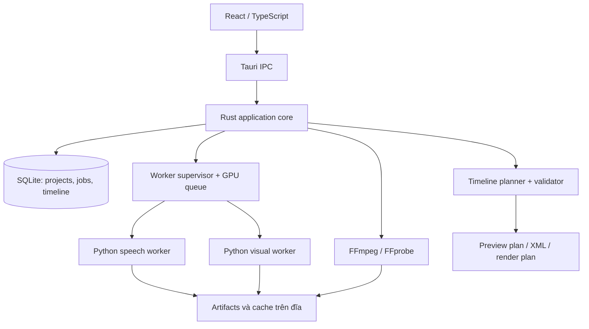

**SyncCut — đề xuất backend mới và bộ model cho máy khách hàng**

Cập nhật 14/09/2026. Cấu hình mục tiêu do người dùng cung cấp: **32 GB RAM, NVIDIA RTX 3060 12 GB VRAM; source chủ yếu tiếng Anh**. Giả định Windows x64 theo nền tảng app hiện tại. CPU, ổ đĩa, driver và phiên bản NLE chưa được cung cấp.

Tài liệu này thay thế khuyến nghị phần cứng/model trong báo cáo audit trước; các phát hiện lỗi của audit vẫn còn giá trị. Đây là thiết kế và lựa chọn để triển khai/benchmark trên máy khách hàng, **chưa phải kết quả đo trên RTX 3060**. Lần cập nhật này không chạy test, tải model hoặc sửa backend sản phẩm trên máy người dùng.

**Quyết định đề xuất**

Giữ **React + TypeScript + Tauri 2 + Rust**, viết lại backend xử lý theo các module độc lập, dùng **Python cho inference và phân tích media**, **SQLite cho project/index/job**, **FFmpeg/FFprobe cho media**. Không cần chuyển sang Electron, dịch vụ cloud hoặc hệ thống microservice. Tách engine khỏi UI để có thể chạy benchmark bằng CLI trên máy khách với cùng cấu hình mà app sử dụng.

Bộ mặc định ưu tiên chất lượng: **Whisper large-v3 → đối chiếu script → WhisperX alignment tiếng Anh → SigLIP 2 → Qwen3-VL 8B 4-bit → bộ lập timeline có ràng buộc**. Preset nhanh thay ASR bằng Distil-Whisper và VLM bằng bản 4B. Chỉ đưa preset qua kiểm thử máy khách vào bản bàn giao.

**Model được chọn và vai trò**

| Công việc | Model/tool đề xuất | Cách chạy ban đầu | Quyết định |
|---|---|---|---|
| Tách vùng có lời đọc | Silero VAD | ONNX Runtime, CPU | Dùng chung hai preset; giữ mapping về timeline audio gốc. |
| ASR ưu tiên chất lượng | `Systran/faster-whisper-large-v3` | faster-whisper/CTranslate2, CUDA, `int8_float16`, `language=en`, batch nhỏ | Mặc định để xây baseline chất lượng; A/B với FP16 nếu lỗi thuật ngữ/tên riêng đáng kể. |
| ASR ưu tiên tốc độ | `distil-whisper/distil-large-v3.5` | faster-whisper với checkpoint CT2 tương thích được khóa revision; hoặc adapter Transformers FP16 khi benchmark | Dùng preset Fast, không mặc định coi chất lượng ngang nhau trên mọi loại audio. |
| Căn thời gian từ/câu | WhisperX với acoustic model tiếng Anh `WAV2VEC2_ASR_BASE_960H` | CUDA; FP32 ban đầu, segment ngắn; alternative cùng họ `facebook/wav2vec2-base-960h` qua adapter HF | Dùng sau đối chiếu transcript/script; khóa tokenizer và normalization. |
| Phát hiện chuyển cảnh | PySceneDetect AdaptiveDetector/ContentDetector | CPU + FFmpeg | Không phải model hiểu nội dung; tách shot trước retrieval. |
| Tìm cảnh bằng hình–text | `google/siglip2-so400m-patch14-384` | Transformers FP16, GPU, batch nhỏ có giới hạn | Lập index ảnh cho toàn bộ footage, tìm ứng viên trên toàn bộ nguồn. |
| Hiểu kịch bản, mô tả cảnh, xếp hạng lại | `Qwen/Qwen3-VL-8B-Instruct` | Transformers + bitsandbytes NF4 4-bit, FP16 compute, batch 1, SDPA | Model chính cho preset Quality; dùng cùng model cho text và visual để giảm số runtime/model cần duy trì. |
| VLM nhanh | `Qwen/Qwen3-VL-4B-Instruct` | Cùng adapter, NF4 4-bit, batch 1 | Preset Fast; chỉ chuyển sang nếu được chọn hoặc được chấp nhận như chế độ suy giảm có nhãn. |
| Tìm kiếm caption/kịch bản tiếng Anh | `BAAI/bge-base-en-v1.5` | sentence-transformers, CPU, batch giới hạn | Nhánh text retrieval bổ sung cho caption đã có; không thay thế image–text embedding. |
| Xác minh/cắt/xếp timeline | Code xác định được | Rust | Không giao cho LLM tự tạo thời lượng hoặc đường dẫn nguồn tùy ý. |

Distil-large-v3.5 thuộc họ Distil-Whisper tiếng Anh và có hướng dẫn tích hợp faster-whisper. Chọn vì phù hợp workload tiếng Anh; số liệu tốc độ của nhà phát hành không phải cam kết trên máy khách. Nguồn: [model card Distil-large-v3.5](https://huggingface.co/distil-whisper/distil-large-v3.5), [faster-whisper](https://github.com/SYSTRAN/faster-whisper/blob/master/README.md).

WhisperX có model alignment mặc định tiếng Anh. Cần giữ hai bước riêng: ASR để biết thực tế được đọc, rồi alignment để định vị từ/câu đã xác minh. Nguồn: [WhisperX alignment implementation](https://github.com/m-bain/whisperX/blob/main/whisperx/alignment.py), [wav2vec2-base-960h](https://huggingface.co/facebook/wav2vec2-base-960h).

SigLIP 2 dùng để xếp hạng hình với mô tả ngắn; Qwen dùng để đánh giá ứng viên sâu hơn, bao gồm hành động và ngữ cảnh. Chất lượng trên các nhân vật/sản phẩm cụ thể vẫn cần mẫu tham chiếu và benchmark. Nguồn: [SigLIP 2 SO400M](https://huggingface.co/google/siglip2-so400m-patch14-384), [Qwen3-VL documentation](https://huggingface.co/docs/transformers/main/en/model_doc/qwen3_vl), [BGE English model card](https://huggingface.co/BAAI/bge-base-en-v1.5).

**Vì sao lựa chọn này phù hợp với 12 GB VRAM**

Đề xuất 8B ở 4-bit để dành bộ nhớ cho vision encoder, activations và KV cache. Không dùng phép tính “8B × 4-bit” làm dung lượng thực tế toàn pipeline. Độ phân giải, số frame và context có thể làm tăng peak memory đáng kể.

Runtime chính là Transformers + bitsandbytes để giữ inference trong Python và hỗ trợ dữ liệu video/multiple-image qua processor chính thức. Bitsandbytes công bố hỗ trợ Windows x86-64/NVIDIA và NF4; vẫn phải kiểm tra cả tổ hợp Qwen, PyTorch, CUDA, bitsandbytes trên máy khách. Nguồn: [bitsandbytes installation](https://huggingface.co/docs/bitsandbytes/main/en/installation), [4-bit quantization](https://huggingface.co/docs/transformers/main/en/quantization/bitsandbytes).

GGUF + llama.cpp là phương án adapter dự phòng nếu benchmark cho thấy lợi ích đóng gói/tốc độ rõ ràng. Bản Qwen3-VL 8B Q4_K_M chính thức có file model khoảng 5.03 GB và projector F16 khoảng 1.16 GB trên đĩa; đây **không phải peak VRAM**. GGUF cần llama.cpp và projector phù hợp, không đưa trực tiếp vào adapter Transformers NF4. Không triển khai hai backend VLM cùng lúc trong MVP. Nguồn: [Qwen GGUF files](https://huggingface.co/Qwen/Qwen3-VL-8B-Instruct-GGUF/tree/main), [llama.cpp multimodal](https://github.com/ggml-org/llama.cpp/blob/master/docs/multimodal.md).

Ngân sách dưới đây là **ước lượng thiết kế để chọn batch/context**, không phải benchmark hay bảo đảm sử dụng bộ nhớ:

| Giai đoạn đang hoạt động | Khoảng VRAM lập kế hoạch | Cách kiểm soát |
|---|---|---|
| Whisper large-v3, INT8/FP16, batch nhỏ | Khoảng 3–6 GB | Khởi đầu batch 1–2, tăng khi có số đo. |
| Alignment tiếng Anh riêng | Khoảng 1–2 GB | Không giữ ASR trên GPU; chia theo vùng lời đọc. |
| SigLIP 2 SO400M | Khoảng 2–5 GB | Khởi đầu batch 4, giới hạn batch theo peak thực tế. |
| Qwen3-VL 8B NF4 | Khoảng 7–10.5 GB với input bị giới hạn | Batch 1; kiểm soát tổng visual tokens, context và output; đo cả prefill. |
| Qwen3-VL 4B NF4 | Khoảng 4–7 GB với input bị giới hạn | Preset Fast hoặc benchmark thay thế. |

Chỉ cấp GPU cho một giai đoạn inference nặng tại một thời điểm. Bộ nhớ mục tiêu của toàn app nên chừa khoảng 1.5–2 GB VRAM cho desktop/decoder và dao động; nếu free memory không đủ thì hạ batch/frame budget hoặc tạm dừng theo chính sách, không âm thầm đổi model. Giới hạn RAM của app ban đầu khoảng 20–24 GB để còn chỗ cho OS; giảm thêm khi khách mở NLE đồng thời. Đo VRAM bằng cả số liệu process/framework và bộ nhớ thiết bị để thấy CTranslate2/FFmpeg ngoài PyTorch.

Qwen: bắt đầu với tổng context khoảng 8k token, output tối đa 512–1024 token và một nhóm ảnh/clip ngắn mỗi request. Giới hạn pixel và visual token theo processor thực tế; không chỉ đếm số frame. 4–8 frame là điểm khởi đầu cho một shot, có thể lấy dày hơn trên vùng chuyển động nhưng phải nằm trong budget. Các con số này là tham số benchmark, không đóng đinh thành tiêu chuẩn chất lượng.

Không nạp một video hàng giờ hoặc hàng nghìn ảnh vào một prompt. Tạo index toàn bộ nguồn bằng embedding, rồi chỉ dùng VLM với các ứng viên được chọn. Batch công việc theo giai đoạn để giảm chi phí load/unload. Khi phải chuyển model, đóng worker của giai đoạn trước là cách rõ ràng để giải phóng CUDA allocations; không chỉ trông chờ `empty_cache()`.

**Hai preset dành cho khách hàng**

| Preset | ASR | Visual reasoning | Chính sách |
|---|---|---|---|
| Quality — mặc định đề xuất | Whisper large-v3 | Qwen3-VL 8B 4-bit | Nhiều ứng viên kiểm tra hơn; phân tích thêm vùng mơ hồ; ưu tiên giảm sửa tay. |
| Fast | Distil-large-v3.5 | Qwen3-VL 4B 4-bit | Ít ứng viên/frame hơn; vẫn kiểm tra alignment và source range như Quality. |

Cùng dùng English forced alignment và SigLIP index để có thể tái sử dụng cache. Chuyển VLM/processor hoặc cấu hình embedding phải làm invalid đúng loại cache liên quan. Preset Quality là ưu tiên sản phẩm, không phải tuyên bố trước rằng large-v3 luôn thắng Distil trên mọi tập dữ liệu.

Qwen3-ASR-1.7B + Qwen3-ForcedAligner-0.6B là **cặp ứng viên A/B giai đoạn sau**: cả hai hỗ trợ tiếng Anh theo tài liệu. Chỉ thay baseline nếu đo được tốt hơn về lỗi tên riêng, timestamp hoặc thời gian tổng. Không thêm mặc định để tránh nhân số tổ hợp runtime cần hỗ trợ. Nguồn: [Qwen3-ASR](https://huggingface.co/Qwen/Qwen3-ASR-1.7B), [Qwen3-ForcedAligner](https://huggingface.co/Qwen/Qwen3-ForcedAligner-0.6B).

**Backend mới: tách trách nhiệm rõ ràng**



Rust là chủ sở hữu trạng thái project/job và transaction database. Python nhận task bất biến và trả artifact + schema hợp lệ; không ghi đồng thời vào cùng DB với Rust. Supervisor cấp GPU, quản lý tiến trình, timeout/cancel/retry và model residency. IPC với worker dùng JSONL qua stdin/stdout; stderr dành cho log, không trộn print tự do vào giao thức. Media playback tiếp tục dùng Tauri asset protocol và proxy local khi codec cần chuyển đổi.

Một engine package Python với hai entrypoint worker theo nhóm speech/visual đủ cho bản đầu. Có thể dùng hai runtime folder biệt lập nếu dependency xung đột, nhưng không tách thêm dịch vụ khi chưa có lý do. Không bắt khách tự cài Python/CUDA toolkit thủ công: bộ runtime đi kèm dependencies đã khóa; bước kiểm tra môi trường xác minh driver và thiết bị phù hợp.

Các module dự kiến:

```text
src-tauri/src/
  commands/                 # IPC mỏng, kiểm tra request
  application/              # use cases và project revision
  jobs/                     # queue, GPU lease, worker supervision
  domain/                   # media, script, beat, shot, timeline
  storage/                  # SQLite migrations và repositories
  media/                    # ffprobe, proxy, waveform
  timeline/                 # planner, timebase, validator
  exporters/                # FCP7 XML và FFmpeg render plan

engine/synccut_engine/
  protocol/                 # schemas, request/result/progress
  speech/                   # VAD, ASR, reconcile, forced alignment
  vision/                   # shot extraction, embeddings, VLM
  retrieval/                # hybrid candidate search và reranking
  models/                   # adapters, manifest, load/unload
  workers/                  # speech/visual entrypoints
```

Đây là cấu trúc đề xuất, chưa tạo các module trong repository. Dùng JSON Schema làm hợp đồng, sinh TypeScript types và kiểm định ở cả Rust/Python. `schema_version`, `job_id`, `project_revision`, `model_revision`, `effective_config` phải theo mọi output quan trọng.

**Luồng xử lý chính xác**

1. **Ingest:** xác minh stream, duration, frame rate phân số/VFR, rotation, resolution, audio track và fingerprint. Asset ID không dựa vào filename. Lưu nguyên bản, tạo proxy/waveform nếu cần và hỗ trợ ảnh tĩnh như loại nguồn riêng.
2. **Speech:** Silero VAD → ASR thực tế → chuẩn hóa tiếng Anh với số, tiền tệ, tên riêng, contractions và viết tắt → đối chiếu script. Không đưa nguyên script vào ASR như đáp án bắt buộc vì cần nhìn thấy sai khác.
3. **Reconcile:** xác định đoạn thiếu/thừa/sai/đọc lại. Cho phép các take; các đoạn chưa xác nhận không được giả là khớp. Giữ text nguyên bản và mapping ký tự/từ sau normalization.
4. **Align:** acoustic alignment trên text đã reconcile trong cửa sổ audio hợp lệ; giữ offset về audio gốc. Mốc từ chưa xác định phải có trạng thái unresolved. Nhóm lời đọc thành story beats độc lập với số câu.
5. **Index:** phát hiện cut → chia bổ sung trong shot dài → keyframes có timestamp → SigLIP embedding cho toàn bộ footage. Ảnh đẹp nhưng không đại diện hành động không đủ để xác nhận toàn đoạn.
6. **Plan context:** Qwen đọc cấu trúc kịch bản để tạo entity registry, shot requirements và mối liên hệ giữa các beat; giữ dấu vết trích từ script. Tên sản phẩm/nhân vật có thể cần reference assets của khách; không suy từ “có mặt người”.
7. **Retrieve:** tìm top 20–30 ứng viên trên visual index toàn bộ nguồn, sau đó chọn khoảng 5–10 ứng viên/beat để VLM xem kỹ. Có thể mở rộng K khi không tìm được cảnh tốt. Các số này phải benchmark.
8. **Verify:** VLM trả JSON có candidate ID, lý do phù hợp/không phù hợp, bằng chứng frame/time, yếu tố còn thiếu. Đối chiếu các beat lân cận và cảnh trước/sau; hành động phải xem chuỗi frame. Không cho model bịa nguồn chưa có trong manifest.
9. **Assemble:** bộ planner chọn tổ hợp shot toàn chuỗi, đủ duration, đúng nhịp, tránh lặp vùng nguồn và bảo vệ clip đã khóa. Voice là trục thời gian, giữ nguyên waveform nếu người dùng chưa chọn biên tập audio.
10. **Review/export:** validator → Program Monitor → editor chỉnh/đổi/khóa → xuất cùng timeline revision sang XML hoặc FFmpeg render plan.

BGE tìm caption chỉ áp dụng cho shot đã có caption. Để tránh vòng lặp đòi hỏi caption trước khi chọn ứng viên, lần chạy đầu **luôn có SigLIP index toàn bộ nguồn**; VLM caption ứng viên và các shot lân cận rồi cache dần. Chế độ deep indexing có thể caption toàn bộ thư viện thành một job riêng nếu khách tái sử dụng nguồn nhiều lần. Không coi các shot chưa caption là không liên quan.

Script requirement và caption quan sát được phải tách riêng: không đưa câu thoại vào yêu cầu caption rồi để model mô tả đúng câu thoại dù ảnh không chứa nội dung đó. Score dùng cho ranking không phải xác suất. Kết quả được phép là `no_match`, `needs_review`, `accepted`.

**Timeline và dữ liệu là phần cần viết lại hoàn toàn**

Các entity chính: `Project`, `MediaAsset`, `TranscriptWord`, `ScriptSpan`, `Take`, `StoryBeat`, `Shot`, `CandidateMatch`, `TimelineClip`, `JobArtifact`. Không còn quan hệ cứng “một câu = một clip”. Timeline lưu sequence timebase và source timebase riêng, dùng integer ticks/frame hoặc rational time; audio có sample clock. Với VFR, giữ mapping timestamp nguồn/proxy thay vì coi mọi frame cách đều.

Các ràng buộc bắt buộc:

- Clip video không vượt EOF hoặc source window đã xác minh.
- Ảnh tĩnh không có duration nguồn giả; thời gian hiển thị thuộc timeline clip.
- Không làm rỗng/ghi đè project khi đóng preview hoặc job thất bại.
- Audio gốc của footage mute trong sequence trừ khi người dùng chọn dùng.
- Khoảng trống, freeze frame, retime và chèn nhiều shot phải là quyết định biểu diễn rõ ràng.
- Preview, XML và render dùng cùng clip/time mapping; serializer không tự dựng lại timeline.
- Đổi input/config tạo revision mới; kết quả job cũ không được áp vào revision mới.
- Rerun giữ các clip đã khóa; editor có lựa chọn cảnh thay thế và lý do lựa chọn.

**Độ bền, cache và đóng gói**

SQLite lưu metadata và trạng thái; thumbnail, waveform, embeddings và proxy lưu trên đĩa. Với thư viện ban đầu, normalized vectors + matrix search theo batch/memory-map đủ để triển khai; chỉ thêm ANN index khi profiling cho thấy cần. Không cần server vector database.

Cache key gồm content fingerprint, model + processor revision, sampling configuration, prompt/schema version. File cache được ghi atomically rồi mới commit manifest. Job ID riêng, không dùng chung `matched_segments.json` cho mọi project. Cancel dừng cả process tree, crash có checkpoint; retry không phát sinh duplicate clip.

Đóng gói app shell và bộ AI runtime/model thành gói cài có manifest và checksum. Installer cho chọn tải model hoặc import offline pack; không tải toàn bộ biến thể weights không dùng. Pin tổ hợp Python/PyTorch/Transformers/bitsandbytes/CT2/cuDNN sau bài smoke test trên máy khách, không cài `latest` mỗi lần chạy. AI settings hiển thị trạng thái model thực; thiếu model, thiếu GPU hoặc OOM phải trả lỗi có nguyên nhân. Nếu dùng adapter GGUF sau này, đó là gói runtime thay thế được benchmark riêng.

**Kế hoạch kiểm thử hoàn toàn trên máy khách hàng**

Gói benchmark chạy đúng engine của app bằng CLI, không phụ thuộc cửa sổ React, đồng thời vẫn có test UI/NLE riêng. Kết quả local gồm manifest phần cứng/driver/runtime/model, effective config, timing từng stage, peak RAM/VRAM, transcript/diff, candidates và timeline validation. Không tự gửi media hoặc log ra ngoài.

| Vòng | Việc làm trên máy khách | Điều kiện quyết định |
|---|---|---|
| 1. Runtime | Nạp từng model, chạy sample ngắn, unload; thử CUDA, quantization, SDPA và offline cache | Không OOM/crash, đúng model/config, đủ headroom. |
| 2. Speech | 30–60 phút voice tiếng Anh đại diện; accent, tên riêng, số, silence, đọc lại | So sánh large-v3/Distil và boundary alignment với mốc editor. |
| 3. Retrieval | Bộ footage đúng lĩnh vực khách, có hard negatives và no-match | Recall@K, tỷ lệ top-1 được giữ, false positive và lý do có bằng chứng. |
| 4. End-to-end | Nhiều dự án thật; một voice, script và nhiều footage/ảnh | Không mất source, timeline hợp lệ; đo thời gian sửa tay trên mỗi phút thành phẩm. |
| 5. Bàn giao | Installer không có môi trường dev; restart/cancel/hết disk/missing model; import NLE | Kết quả tái mở được, export đúng metadata và giữ sync. |

Khởi đầu có thể thảo luận ngưỡng median lệch biên <=150 ms và P95 <=300 ms; đây là mục tiêu thử nghiệm, không phải độ chính xác đã chứng minh. Timeline validator yêu cầu 100% clip hợp lệ. Quyết định model dựa trên cả công sức editor và latency, không chỉ WER hoặc benchmark nhà phát hành. CPU, SSD/HDD, độ dài footage và việc NLE chiếm GPU đồng thời sẽ ảnh hưởng tổng thời gian; chưa đưa cam kết “x phút để xử lý một giờ video”.

**Trình tự triển khai**

1. Xây contract/schema, domain project, job supervisor, model manifest và validator; loại bỏ fallback tạo điểm giả.
2. Hoàn thiện một luồng voice–script tiếng Anh với mismatch review và alignment; đo trên máy khách.
3. Xây shot index + SigLIP retrieval + Qwen rerank; dùng một bộ footage có đáp án editor.
4. Xây planner, source/program monitor, review/lock/rerun và export thống nhất.
5. Hoàn thiện cache, runtime bundle, offline pack, recovery và nghiệm thu NLE.

UI hiện tại có thể tái sử dụng bố cục và một số component, nhưng state management phải theo project revision mới. Backend cũ nên được giữ riêng trong giai đoạn chuyển đổi để đối chiếu, không tiếp tục chạy hai pipeline khác nhau dưới cùng nút Analyze. Bộ mặc định đề xuất cuối cùng: **large-v3 + English WhisperX alignment + SigLIP 2 SO400M + Qwen3-VL 8B NF4**, xử lý tuần tự trên GPU của máy khách; preset Fast dùng **Distil-large-v3.5 + Qwen3-VL 4B NF4**.
