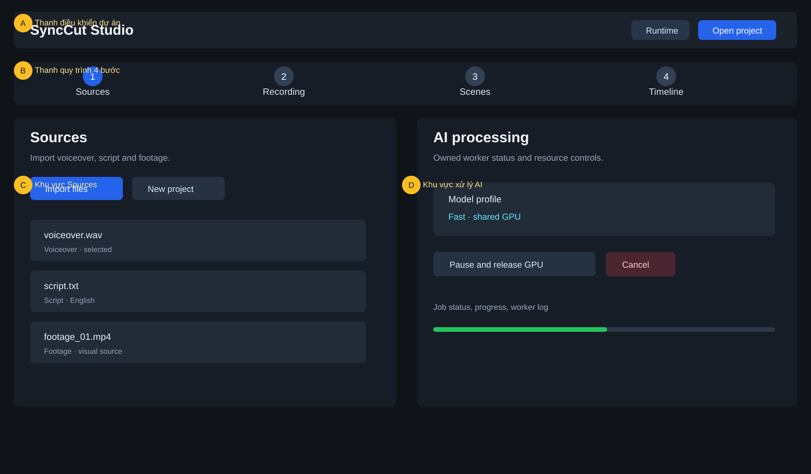
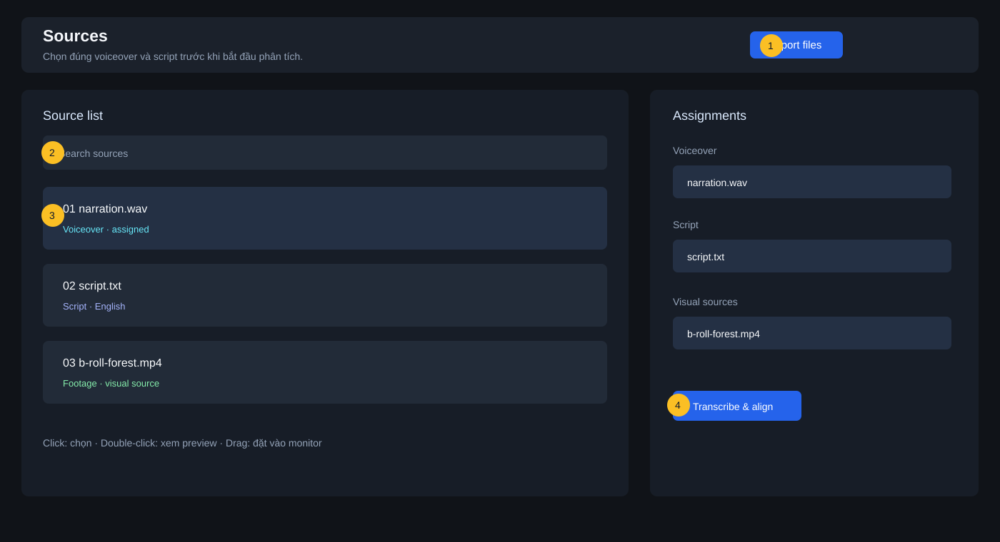
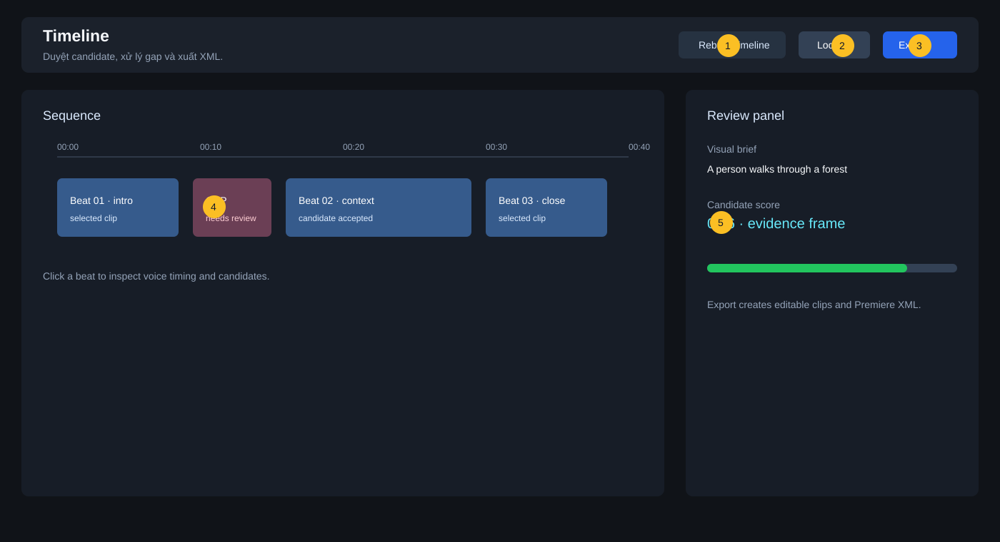

# Hướng dẫn giao diện bằng hình ảnh

Trang này giải thích các khu vực và nút chính trên giao diện SyncCut. Các số màu vàng trong hình là điểm cần chú ý; tên nút giữ nguyên tiếng Anh để khớp với ứng dụng.

## 1. Nhìn tổng thể

**A — Thanh điều khiển dự án:** `Set up AI` mở trình cài runtime/model; khi đủ thành phần nút đổi thành `AI ready`. `Open project` mở hoặc tạo project.

**B — Thanh quy trình:** bốn bước đi theo thứ tự `Sources → Recording → Scenes → Timeline`. Có thể quay lại bước trước để sửa dữ liệu; khi đang có job chạy, một số nút sẽ bị khóa.

**C — Sources:** nơi import và gán voiceover, script, footage/image. Đây là bước bắt buộc trước khi phân tích.

**D — Khu vực xử lý AI:** hiển thị profile, tiến độ và log của worker. `Pause and release GPU` tạm dừng job để nhường GPU cho Premiere hoặc game; `Cancel` hủy job hiện tại.

## 2. Sources — nhập dữ liệu

1. **Import files:** chọn nhiều file cùng lúc. SyncCut tự nhận dạng phần mở rộng và gợi ý loại nguồn.
2. **Search sources:** lọc danh sách khi project có nhiều footage.
3. **Source row:** click để chọn; double-click để xem preview; kéo vào monitor để đặt điểm bắt đầu xem. Chọn đúng file voiceover và script ở panel gán nguồn.
4. **Transcribe & align:** đọc audio thực tế, nhận dạng lời nói và căn với script. Chỉ chạy sau khi đã kiểm tra voiceover/script.

Sau khi import, hãy kiểm tra nhãn `Voiceover`, `Script` và `Footage`. Nếu nhận dạng sai, chọn lại role trước khi chạy bước tiếp theo.

## 3. Recording — kiểm tra lời đọc

Từ thanh quy trình, chọn `Recording` sau khi job speech hoàn tất. Mở từng beat có confidence thấp, bấm play ở monitor và so sánh lời thực tế trong audio, câu script tương ứng, cùng thời gian bắt đầu/kết thúc của beat.

Sửa script hoặc đánh dấu ngoại lệ trước khi sang `Scenes`. Không nên dùng cảnh để che một lỗi căn chỉnh voiceover.

## 4. Scenes — duyệt đề xuất cảnh

Ở `Scenes`, mỗi beat có visual brief, candidate và evidence frame. Chọn candidate phù hợp với ngữ cảnh; bỏ candidate mờ, sai chủ thể, trùng lặp hoặc không đủ thời lượng. Điểm cao chỉ là gợi ý, không thay thế việc xem frame và preview.

## 5. Timeline — chỉnh và xuất

1. **Rebuild timeline:** tạo lại các slot từ lựa chọn hiện tại sau khi thay candidate hoặc timing.
2. **Lock:** khóa lựa chọn đã duyệt để tránh thay đổi ngoài ý muốn.
3. **Export:** tạo các clip đã chuẩn hóa frame clock, manifest nguồn và XML cho Premiere Pro.
4. **GAP:** khoảng trống cần xử lý; không để gap ngoài ý muốn trước khi export.
5. **Candidate score/evidence:** mở panel review để xác nhận lý do chọn cảnh.

Sau khi export, mở XML trong Premiere Pro và relink về thư mục footage gốc. Kiểm tra lại các điểm cắt và audio trước khi giao.

## 6. Khu vực Jobs và tài nguyên

Khi một job đang chạy, khu vực Jobs hiển thị stage, progress, trạng thái và đường dẫn worker log. Dùng `Pause and release GPU` khi cần giải phóng VRAM; dùng `Resume` để tiếp tục từ checkpoint. Nếu có lỗi, đọc log trước khi retry và chuyển từ `Quality` sang `Fast` khi gặp lỗi VRAM.

## 7. Quy tắc thao tác an toàn

- Không di chuyển hoặc đổi tên source sau khi import.
- Không đóng ứng dụng khi job đang ghi checkpoint, trừ khi đã Pause.
- Luôn xem lại evidence frame, gap/overlap và file export.
- Chỉ dùng `Cancel` khi chấp nhận phải chạy lại phần chưa hoàn tất.
